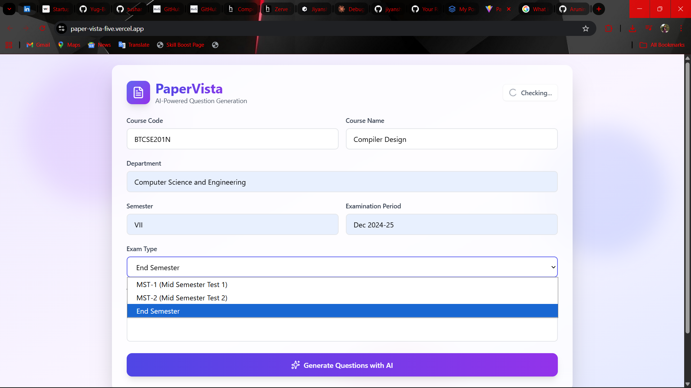
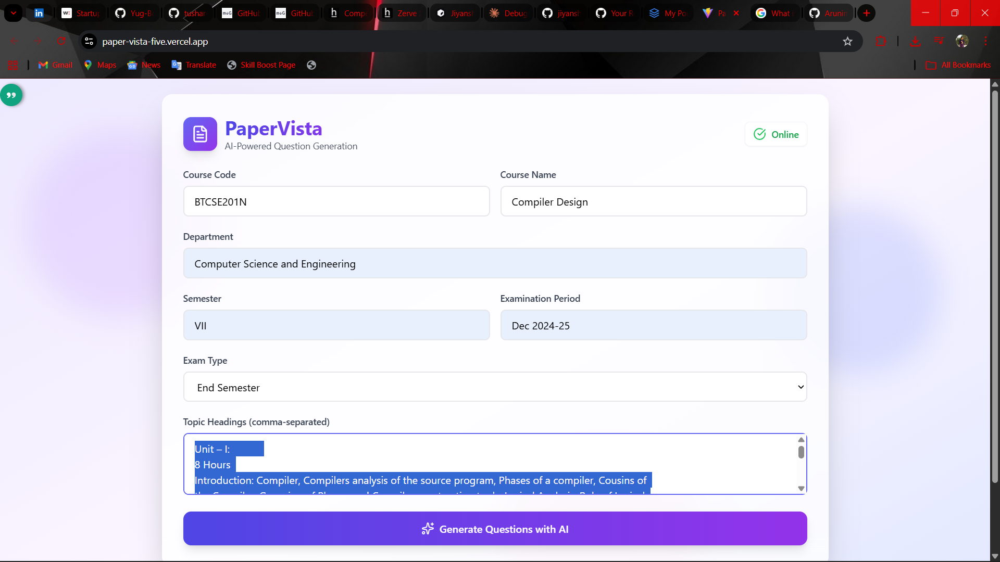
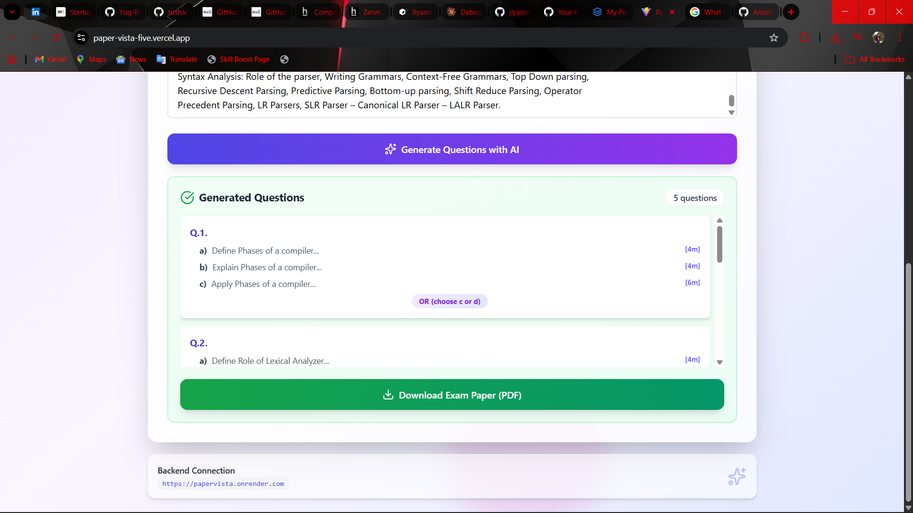
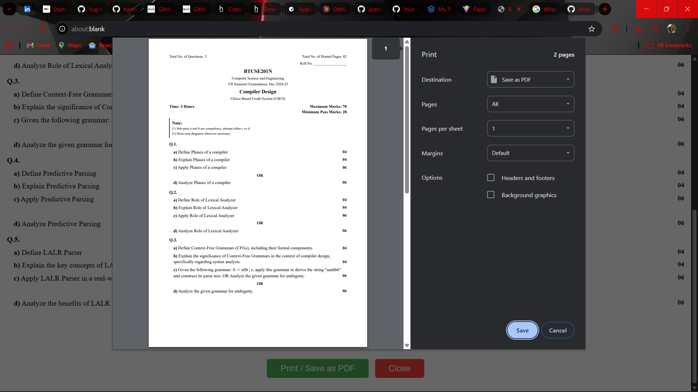

# PaperVista - AI-Powered Exam Paper Generator

PaperVista is a full-stack web application that leverages Google's Gemini AI to generate high-quality, customized exam papers. The platform provides an intuitive interface for educators to create exam questions based on course details, exam types, and specific topics.

## 📋 Project Overview

PaperVista combines a modern React frontend with a FastAPI backend to deliver an intelligent exam paper generation system. Users can specify course information, select exam types, choose topics, and generate structured exam questions with multiple parts and difficulty levels.

## 🎯 Key Features

- **AI-Powered Question Generation** - Uses Google Gemini API for intelligent question creation
- **Multiple Exam Types** - Support for MST-1, MST-2, and End-Semester exams
- **Customizable Parameters** - Course details, topics, and question configurations
- **Structured Output** - Organized question format with parts (a, b, c) and marks allocation
- **Responsive Design** - Works seamlessly on desktop and tablet devices
- **Real-time Processing** - Fast question generation with optimized API usage

## 🏗️ Tech Stack

### Frontend
- **React 19.1.1** - User interface library
- **Vite 7.1.7** - Build tool and development server
- **Tailwind CSS 3.4.18** - Utility-first CSS framework
- **PostCSS 8.5.6** - CSS transformation
- **Lucide React 0.544.0** - Icon library

### Backend
- **FastAPI 0.115.0** - Python web framework
- **Uvicorn 0.32.0** - ASGI web server
- **Google Generative AI 0.8.3** - Gemini API integration
- **Pydantic 2.9.2** - Data validation
- **Python 3.11.9** - Programming language

## 📸 Project Showcase

### Exam Type Selection

*Select from multiple exam types including MST-1, MST-2, and End-Semester exams. Specify course code, semester, subject name, department, and examination period.*

**Input Fields:**
- Course Code
- Semester
- Subject Name
- Department
- Examination Period

### Topic Configuration

*Configure exam topics and course-specific parameters for question generation*

### Overview

*Main dashboard showcasing the complete exam paper generation interface*

### Print & Export

*Generate, preview, and print customized exam papers in professional format*

## 🚀 Getting Started

### Prerequisites

- **Node.js** (v16 or higher) - For frontend
- **Python** (3.8 or higher) - For backend
- **Google Generative AI API Key** - Get from [Google AI Studio](https://aistudio.google.com)
- **npm or yarn** - Package managers

### Installation

#### Backend Setup

1. Navigate to the backend directory:
```bash
cd backend
```

2. Install dependencies:
```bash
pip install -r requirements.txt
```

3. Create a `.env` file in the backend directory:
```
GEMINI_API_KEY=your_gemini_api_key_here
FRONTEND_URL=http://localhost:5173
PORT=8000
```

4. Start the development server:
```bash
python main.py
```

The API will be available at `http://localhost:8000`

#### Frontend Setup

1. Navigate to the frontend directory:
```bash
cd frontend
```

2. Install dependencies:
```bash
npm install
```

3. Start the development server:
```bash
npm run dev
```

The application will be available at `http://localhost:5173`

## 📚 API Endpoints

### Health Check
**GET** `/health`

Check API status and available Gemini models.

### Generate Questions
**POST** `/api/generate-questions`

Generate exam questions based on course details.

**Request Body:**
```json
{
  "courseName": "Data Structures",
  "examType": "MST-1",
  "topicHeadings": "Arrays, Linked Lists, Stacks, Queues"
}
```

**Parameters:**
- `courseName` (string, required) - Course name
- `examType` (string, required) - MST-1, MST-2, or End-Sem
- `topicHeadings` (string, required) - Comma-separated topics

**Exam Type Details:**
- **MST-1/MST-2**: 2 questions, 1 hour
  - Part A: 3 marks | Part B: 3 marks | Part C: 4 marks
  
- **End-Sem**: 5 questions, 3 hours
  - Part A: 4 marks | Part B: 4 marks | Part C: 6 marks

## 📁 Project Structure

```
PaperVista/
├── frontend/                          # React application
│   ├── src/
│   │   ├── components/
│   │   │   └── ExamPaperGenerator.jsx # Main component
│   │   ├── App.jsx                    # Root component
│   │   ├── main.jsx                   # Entry point
│   │   └── index.css                  # Global styles
│   ├── public/                        # Static files
│   ├── package.json                   # Dependencies
│   ├── vite.config.js                 # Vite configuration
│   └── tailwind.config.js             # Tailwind configuration
│
├── backend/                           # FastAPI server
│   ├── main.py                        # API endpoints and logic
│   ├── requirements.txt               # Python dependencies
│   └── .env                           # Environment variables
│
├── images/                            # Project screenshots
├── render.yaml                        # Deployment configuration
├── runtime.txt                        # Runtime specification
└── README.md                          # This file
```

## ⚙️ Configuration

### Environment Variables

**Backend (.env)**
| Variable | Description | Default |
|----------|-------------|---------|
| `GEMINI_API_KEY` | Google Generative AI API key | Required |
| `FRONTEND_URL` | Frontend application URL | `http://localhost:5173` |
| `PORT` | Backend server port | 8000 |

### CORS Configuration

The backend accepts requests from:
- Frontend production URL
- `http://localhost:5173` (Dev server)
- `http://localhost:3000` (Alternative local)

## 🔧 Development Commands

### Frontend
```bash
# Start development server
npm run dev

# Build for production
npm run build

# Preview production build
npm run preview

# Run ESLint
npm run lint
```

### Backend
```bash
# Start development server
python main.py

# Access API documentation
# Swagger UI: http://localhost:8000/docs
# ReDoc: http://localhost:8000/redoc
```

## 🚢 Deployment

### Deployment Platforms
- **Render.com** - Recommended (see render.yaml)
- **Heroku**
- **Azure**
- **Google Cloud Platform**
- **AWS**

### Deployment Configuration
The project includes `render.yaml` for easy deployment to Render.com. Ensure all environment variables are configured in your deployment platform.

## 🤖 AI Generation Features

### Two-Phase Generation Process
1. **Phase 1: Outline** - Creates question structure with minimal tokens
2. **Phase 2: Content** - Generates detailed question content

### Model Fallback Strategy
- Primary: `gemini-2.5-flash`
- Fallback 1: `gemini-2.5-flash-lite`
- Fallback 2: `gemini-3-flash`

### Error Handling
- **429 Quota Exceeded** - API quota limit reached
- **401 Invalid API Key** - Missing or invalid configuration
- **504 Timeout** - Request timeout protection
- **500 Server Error** - Internal processing error

## 🐛 Troubleshooting

### Invalid API Key Error
- Verify `GEMINI_API_KEY` in `.env` is correct
- Enable Generative AI access in Google Cloud Console

### Quota Exceeded
- Wait before making another request
- Check API quota limits in Google Cloud Console

### CORS Errors
- Verify `FRONTEND_URL` matches your frontend URL
- Check that the frontend URL is in the `allow_origins` list

### Timeout Issues
- The request may have taken too long
- Try with simpler topics or fewer questions
- Check your internet connection

## 📝 Development Notes

### Frontend Development
- HMR (Hot Module Replacement) enabled for fast development
- Tailwind CSS provides rapid styling
- ESLint enforces code quality

### Backend Development
- FastAPI provides automatic API documentation
- Pydantic ensures data validation
- Async request handling for performance

### Testing Locally
1. Start backend on `http://localhost:8000`
2. Start frontend on `http://localhost:5173`
3. The frontend will automatically connect to the backend API
4. Access API docs at `http://localhost:8000/docs`

## 🔐 Security

- CORS protection enabled
- API key stored in environment variables
- Input validation via Pydantic
- Rate limiting protection
- Secure error handling without exposing sensitive data

## 📄 License

This project is open source. Refer to the LICENSE file for more information.

## 👥 Contributing

Contributions are welcome! Please feel free to submit pull requests or open issues for bugs and feature requests.

## 📞 Support

For issues, questions, or suggestions, please open an issue on the project repository.

---

**Happy Exam Paper Generating! 🎓**

Built with ❤️ using React, FastAPI, and Google Gemini AI
